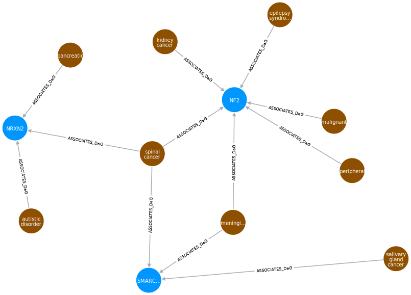

## Methods

### Heterogeneous networks

Heterogeneous networks ('hetnets') are networks with multiple node types and edge types.
In the network used this summer, titled Hetionet v1.0 (Figure {@fig:metagraph}B), nodes represent instances of 11 biomedical entity types, and edges correspond to one of 24 edge types, or relationships between entities.
'Graph' in this context refers to the entire network of nodes and edges.
We define 'metagraph' to mean a graph of the types of nodes and edges in Hetionet (Figure {@fig:metagraph}A).

{#fig:metagraph}

Hetionet v1.0 incorporated 47,031 nodes and 2,250,197 edges [@doi:10.1101/087619]. A further breakdown of the nodes and edges can be found below in Tables @tbl:nodes-by-type and @tbl:nodes-by-source, respectively.

| Metanode | Nodes |
|----------|-------|
|Anatomy             | 402 |           
|Biological Process  | 11,381 |       
|Cellular Component  | 1,391 |         
|Compound            | 1,552 |        
|Disease             | 137 |          
|Gene                | 20,945 |       
|Molecular Function  | 2,884 |       
|Pathway             | 1,822 |        
|Pharmacologic Class | 345 |          
|Side Effect         | 5,734 |        
|Symptom             | 438 |           

Table: Breakdown of nodes by type {#tbl:nodes-by-type}

| Metaedge                               | Edges          | Source                                           |
|----------------------------------------|----------------|--------------------------------------------------|
| Anatomy-downregulates-Gene             | 102,240        | Bgee                                             |
| Anatomy-expresses-Gene                 | 526,407        | Bgee and TISSUES                                 |
| Anatomy-upregulates-Gene               | 97,848         | Bgee                                             |
| Compound-binds-Gene                    | 11,571         | BindingDB, DrugBank, DrugCentral                 |
| Compound-causes-Side Effect            | 138,944        | SIDER                                            |
| Compound-downregulates-Gene            | 21,102         | LINCS L1000                                      |
| Compound-palliates-Disease             | 390            | PharmacotherapyDB                                |
| Compound-resembles-Compound            | 6,486          | Dice coefficient \textgreater= 0.5               |
| Compound-treats-Disease                | 755            | PharmacotherapyDB                                |
| Compound-upregulates-Gene              | 18,756         | LINCS L1000                                      |
| Disease-associates-Gene                | 12,623         | GWAS Catalog, DISEASES, DisGeNET, DOAF           |
| Disease-downregulates-Gene             | 7,623          | STARGEO                                          |
| Disease-localizes-Anatomy              | 3,602          | MEDLINE                                          |
| Disease-presents-Symptom               | 3,357          | MEDLINE                                          |
| Disease-resembles-Disease              | 543            | MEDLINE                                          |
| Disease-upregulates-Gene               | 7,731          | STARGEO                                          |
| Gene-covaries-Gene                     | 61,690         | Evolutionary rate covariation \textgreater= 0.75 |
| Gene-interacts-Gene                    | 147,164        | Evolutionary rate covariation \textgreater= 0.75 |
| Gene-participates-Biological Process   | 559,504        | Gene Ontology                                    |
| Gene-participates-Cellular Component   | 73,566         | Gene Ontology                                    |
| Gene-participates-Molecular Function   | 97,222         | Gene Ontology                                    |
| Gene-participates-Pathway              | 84,372         | Gene Ontology                                    |
| Gene-regulates-Gene                    | 265,672        | Gene Ontology                                    |
| Pharmacologic Class-includes-Compound  | 1,029          | DrugCentral                                      |

Table: Breakdown of edges by type and data source {#tbl:nodes-by-source}

### Graph analysis

An adjacency matrix refers to a labeled matrix with 1 or 0 at every position, corresponding to the presence or absence of a connection between two nodes [@url:http://mathworld.wolfram.com/AdjacencyMatrix.html].
The matrix is labeled, meaning that each row and column correspond to a source and target node, respectively.
A function was created, titled `metaedge_to_adjacency_matrix` which performed the conversion from a string metaedge, such as 'DaG', to an adjacency matrix.

{#fig:eg_graph width="5in"}

For example, the graph in Figure @fig:eg_graph has the following adjacency matrix corresponding to 'GaD':

$$
\begin{equation}
\begin{bmatrix}
1 & 1 & 0 & 1 & 1 & 1 & 0 & 1 & 0\\
0 & 0 & 1 & 1 & 0 & 0 & 1 & 0 & 0\\
0 & 0 & 0 & 1 & 0 & 0 & 0 & 1 & 1
\end{bmatrix}
\end{equation}
$$

with labels for rows and columns, respectively:

\begin{bmatrix}
\textrm{NF2}\\
\textrm{NRXN2}\\
\textrm{SMARCE1}
\end{bmatrix}

\begin{bmatrix}
\textrm{epilepsy syndrome}\\
\textrm{kidney cancer}\\
\textrm{pancreatic cancer}\\
\textrm{spinal cancer}\\
\textrm{malignant mesothelioma}\\
\textrm{peripheral nervous system neoplasm}\\
\textrm{autistic disorder}\\
\textrm{meningioma}\\
\textrm{salivary gland cancer}
\end{bmatrix}

An adjacency matrix is identical to the information about connections between nodes along a given metaedge.
Another way to consider an adjacency matrix is as a list of the nodes at which one can arrive in one step from a given start node.
In this sense, performing a matrix multiplication with two adjacency matrices gives the nodes at which one can arrive in exactly *two* steps.
Further, an arbitrary number of multiplications can be performed between adjacency matrices corresponding to various metaedges, so long as the dimensionality is appropriate to the matrix multiplication in question.
Using this method, we can extract what is known as a walk count, or the number of ways to traverse the graph between two nodes.
In this way of thinking, an adjacency matrix corresponds to the path count for paths of length one.
Using the graph in Figure @fig:eg_graph, we could perform a traversal along the meta*path* 'GaDaG', and would obtain the following matrix:

\begin{bmatrix}
6 & 1 & 2\\
1 & 3 & 1\\
2 & 1 & 3
\end{bmatrix}

Notice that the elements along the main diagonal of the above matrix are not zero.
This indicates that we are accounting for walks in which we traverse the nodes as follows: 'NF2' ⟶ 'kidney cancer' ⟶ 'NF2'.
Looping walks do not provide useful information, and they introduce considerable noise in measures of connection between nodes.
We therefore wanted to eliminate any usage of walk count and replace it with path count, where a path is a type of walk which *cannot* loop backwards on itself.
In this example and for paths of length two, this is trivial; we simply subtract the main diagonal, and we have converted from a walk count to a path count.
However, this conversion becomes non-trivial when dealing with longer paths and overlapping metanode repeats.
Using the graph in Figure @fig:eg_graph, _NF2—associates—spinal cancer—resembles—peripheral nervous system neoplasm—associates—NF2_ is considered a walk, but it is not a path because its start and end nodes are the same.
Note that it is perfectly acceptable to repeat *metanodes*, meaning that we can have metapaths of the form 'CrCrCrC'.
Paths simply exclude the repeat of *specific nodes* within an ordering of nodes.

Path counts provide useful information for predicting potential new relationships within a graph.
Higher path-counts between two nodes shows good performance as a feature for predicting novel connections [@doi:10.1371/journal.pcbi.1004259].
However, as high-degree nodes by definition make many connections, superior performance was achieved by downweighting nodes according to their degree.
To do this, row sums and column sums are taken for a matrix at each step.
These one-dimensional arrays are exponentiated by a damping exponent, and the matrix is multiplied by each array (vector).
This represents the 'degree-weight' portion of the 'degree-weighted path count'.
My work toward this will be further discussed in the Results section.

Finally, I will make a note on how actual predictions are performed.
Once we have calculated the DWPC over all the considered metapaths, we use the best of these path counts as features to train a machine learning (logistic regression) model.
Once trained, the model's performance is assessed by comparing its predictions to known relationships.
Since we cannot exclude test paths from the overall network, however, we must compare each feature's performance to its performance on a 'permuted hetnet', or an identical network in which the edges have been randomly reassigned, while node-degree has been universally preserved.
The corrected measure we use to assess feature performance is therefore the ΔAUROC, the difference in area under (AU) the receiver operating characteristic (ROC) curve.
Once our model is trained and tested, we can translate DWPC data for specific connections into the probability that a compound treats a disease.

### Computational tools

All computational work was done in Python version 3.6.
We used an open-source Conda environment to manage packages and dependencies for Python.

#### Matrices

Python's mathematical and array library, NumPy [@url:https://github.com/numpy/numpy], has an n-dimensional array class called an `ndarray`.
`numpy.ndarray`s are very useful for representing matrix information, and have superior functionality for our purposes than the native `numpy.matrix` class.
However, as can be seen in Table @tbl:nodes-by-type, the number of nodes in a given adjacency matrix can be upwards of 20,000.
In performing matrix multiplications, this can become a computation-intensive process that requires both significant CPU power and memory.
Additionally, since the adjacency matrices are full of more zeros than ones, a majority of the multiplications performed are trivial zero multiplications.

One of my early goals for the summer was the conversion of all walk-count (and subsequently, path count) functions to sparse matrices.
Sparse matrices, as employed by the Python library SciPy [@url:https://github.com/scipy/scipy], represent data in matrices which are primarily composed of zeros.
The selection of sparse representation and threshold are discussed in the Results section, but sparse matrices warrant a brief description.

In the sparse representation we used, compressed-sparse-column format (CSC), a matrix is stored as three one-dimensional arrays.

Consider the following matrix:

\begin{bmatrix}
4 & 5 & 0 & 0\\
0 & 0 & 1 & 0\\
3 & 0 & 0 & 9\\
0 & 6 & 0 & 5
\end{bmatrix}

We represent the nonzero elements with one array, with the elements being taken from top to bottom, from left to right.

\begin{bmatrix}
4 & 3 & 5 & 6 & 1 & 9 & 5
\end{bmatrix}

Next, we give the row indices of these elements.

\begin{bmatrix}
0 & 2 & 0 & 3 & 1 & 2 & 3
\end{bmatrix}

The final array represents what is called a column pointer.
This array gives the indices of the first array where each column starts.

\begin{bmatrix}
0 & 2 & 4 & 5 & 7
\end{bmatrix}

These three arrays represent the entirety of a matrix.

#### Other tools

A significant amount of work done later in the summer involved attempting to compare the new functions to the quite slow old functions.
As has become relatively standard for much of computational work, we made use of Jupyter notebooks [@url:https://github.com/jupyter/notebook] to display the code used to run analysis and its output in a re-usable way.
Within this, we were able to effectively incorporate the data manipulation and analysis library pandas [@url:https://github.com/pandas-dev/pandas] and the multiprocessing library concurrent.futures [@url:https://docs.python.org/3/library/concurrent.futures.html].
For visualization, we utilized the online service Neo4j to represent Hetionet v1.0 [@url:https://neo4j.het.io/browser/], and the Python graphing libraries Matplotlib [@url:https://github.com/matplotlib/matplotlib] and seaborn [@url:https://seaborn.pydata.org/].

The most important tool we used this summer to track progress was the version control software, Git.
Our repositories were hosted on the online git hosting service, GitHub [@url:https://github.com/greenelab/].
Specifically, every contribution I made this summer can be viewed in detail at my GitHub profile (https://git.io/v5qC9).
This will be discussed further in the Results section below.
